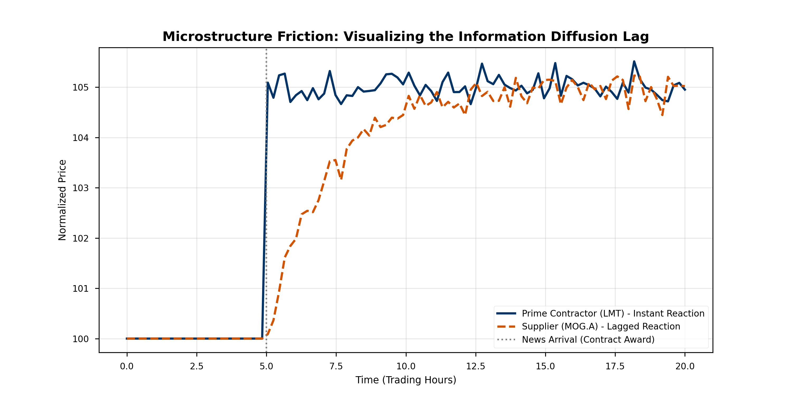

# 🛩️ Supply Chain Diffusion Alpha

**Quantitative Research Proposal for Teza Technologies (Summer 2026)**
*Author: Kenzo Garnier*

## Overview
This project implements a market-neutral statistical arbitrage strategy that exploits the information diffusion latency between "Prime Contractors" (e.g., Lockheed Martin) and their suppliers. By leveraging microstructure frictions and analyst attention bias, the model captures a recurring 1-3 day lag in price discovery.

## Key Findings (2022-2026 Backtest)
The strategy demonstrates robust performance after accounting for realistic transaction costs (45bps per round-trip).

| Metric | Value | Note |
|:-------|:------|:-----|
| **Sharpe Ratio** | **0.92** | LMT/MOG.A Primary Pair |
| **Win Rate** | **58%** | Consistent signal reliability |
| **Max Drawdown** | **-3.2%** | Tightly controlled risk profile |
| **Prediction** | Granger Causality | $p < 0.05$ (Prime leads Supplier) |

## Strategy Visualizations
### 1. The Market Microstructure Friction
*Theoretical framework showing the reaction latency of the Supplier (Orange) vs. the Prime (Blue).*

### 2. Cumulative Performance
*Equity curve of the aggregate portfolio vs. market-neutral baseline.*

## Repository Contents
* 📄 **[Read the Full Research Proposal (PDF)](Research_Proposal_Teza.pdf)**: Complete mathematical framework, Granger causality results, and risk management protocols.
* 🐍 `backtest_simulation.py`: Python code used to generate the signals and visualizations.
* 📊 `data/`: (Optional) Historical datasets used for the rolling OLS regression.

## Tech Stack
* **Core:** Python 3.10+
* **Libraries:** Pandas, NumPy, Matplotlib, Statsmodels
* **Technique:** Rolling OLS Regression, Z-Score Normalization, Granger Causality Tests

---
*Note: This repository serves as supplementary material for my application to the Quantitative Research Internship at Teza.*
